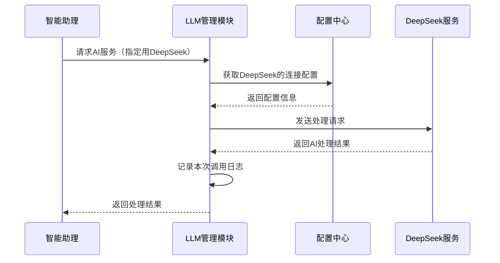
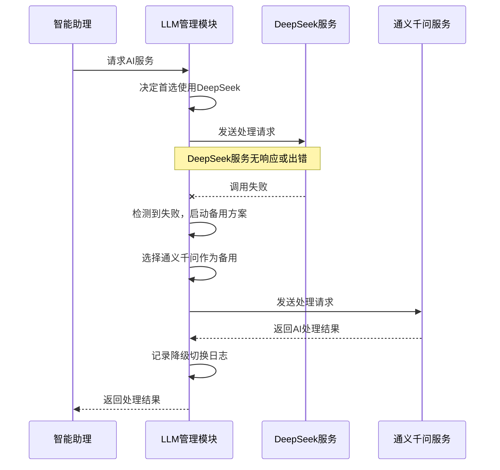

# LLM集成管理模块需求规格说明书（业务版）

**文档版本：** 2.2
**修订日期：** 2024-05-15
**目标模块：** LLM集成管理模块
**文档状态：** 正式

---

## 1. 这是什么？

本文档描述了“LLM集成管理模块”需要做什么。这个模块是系统智能能力的“引擎”，负责连接和使用不同的人工智能大脑（大语言模型，如DeepSeek、通义千问等），让系统能够理解用户指令、生成文档内容。

## 2. 模块的核心目标

为系统提供一个**统一、稳定、可灵活配置**的智能服务调用入口，让系统可以：
1.  同时使用多个不同的人工智能服务。
2.  在某个服务出现问题时，自动切换到其他可用的服务。
3.  方便地管理和调整这些服务的连接设置。

## 3. 主要功能需求

### 3.1 支持多种AI模型
- **需求：** 必须能同时接入和管理多个AI服务。
- **具体要求：**
    - 第一版必须支持 **DeepSeek** 和 **通义千问**。
    - 未来增加新的AI服务时，应尽量通过修改配置即可完成，无需大量改动代码。

### 3.2 提供简单统一的调用方式
- **需求：** 系统其他部分（如核心的“智能助理”）在需要调用AI能力时，只需使用一套简单的指令，无需关心背后具体是哪个AI服务在工作。
- **好处：** 简化开发，提高灵活性，未来更换AI服务时不影响其他功能。

### 3.3 灵活的配置管理
- **需求：** 所有AI服务的连接信息（如访问密钥、服务地址、默认参数）都应支持通过配置文件进行管理。
- **具体要求：**
    - 可以随时在配置中启用或停用某个AI服务。
    - 修改配置（如更换密钥）后，应能快速生效。

### 3.4 智能的模型选择与故障切换
- **需求：** 模块应能智能地决定使用哪个AI服务，并在一个服务不可用时自动使用备用服务。
- **工作模式：**
    1.  **指定使用：** 可以明确要求使用某个特定模型（例如，强制使用DeepSeek）。
    2.  **自动切换：** 当首选模型调用失败（如网络超时、服务异常）时，能自动、无缝地切换到另一个配置好的备用模型继续完成任务。

### 3.5 运行情况记录
- **需求：** 模块需要记录每一次AI调用的基本情况，便于监控和问题分析。
- **记录内容：** 调用时间、使用了哪个模型、大概耗时、成功还是失败。

## 4. 核心工作流程

### 4.1 正常调用流程
当系统需要AI服务时，本模块的工作步骤如下图所示：

### 4.2 故障自动切换流程
当首选AI服务出现问题时，本模块会自动启用备用方案，保证服务不中断：

## 5. 非功能要求（运行质量要求）

### 5.1 性能与稳定
- **快速响应：** 本模块自身的处理应非常快，不能成为系统瓶颈。
- **高可用：** 即使所有外部AI服务暂时都不可用，本模块自身也不能崩溃，而应向调用方清晰报错。
- **抗故障：** 单次AI调用失败不应影响后续的其他请求。

### 5.2 安全与管理
- **安全存储：** AI服务的访问密钥等敏感信息必须安全存储，不能明文写在代码里。
- **易于调整：** 所有策略（如超时时间、重试次数）都应支持通过配置调整，无需修改代码。
- **日志清晰：** 运行日志要能清楚地看到模块的决策过程，比如为何切换了AI服务。

## 6. 限制与依赖

1.  **技术限制：** 本模块将使用Python语言开发。
2.  **外部依赖：** 依赖于外部AI服务（如DeepSeek、通义千问）的稳定性和可用性。
3.  **架构遵循：** 模块设计需符合系统整体的架构规范。

## 7. 附录

### 7.1 支持的业务场景
本模块直接支撑以下系统功能：
- 用户配置和管理可用的AI模型。
- 智能助理根据情况选择合适的AI模型来执行任务。
- 当某个AI模型故障时，系统自动切换到其他模型，保证任务继续执行。

### 7.2 待明确事项
1.  更复杂的模型选择策略（例如，根据任务类型或成本自动选择模型）的具体规则。
2.  对AI服务使用量的精确统计和成本估算功能。