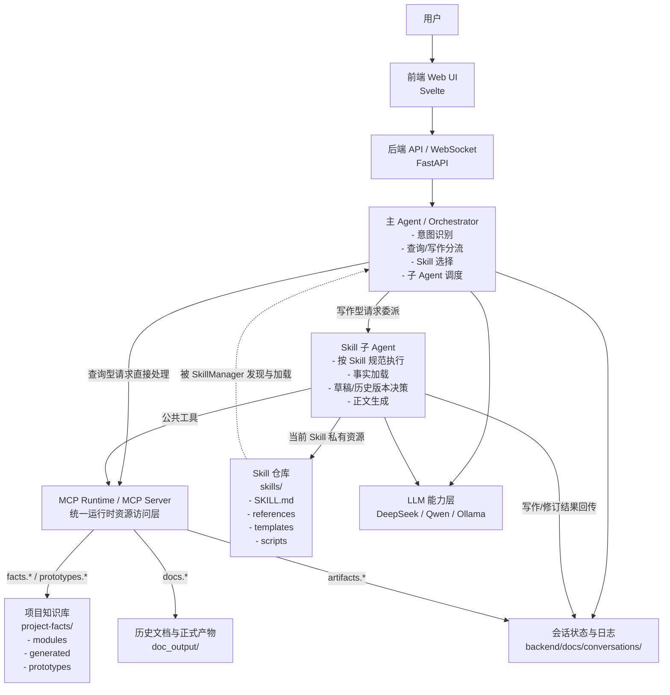
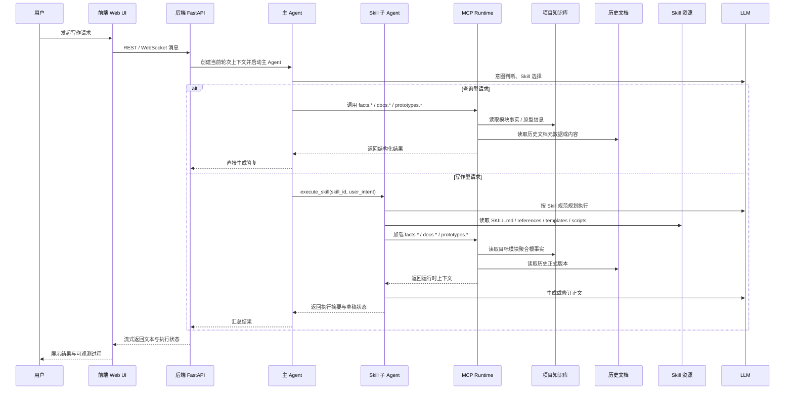

# NextAgent Doc Assistant 架构图

## 1. 整体关系图

## 2. 写作场景执行链路图

## 3. 设计关系解读

- 主 Agent 是编排中心，负责判断“要做什么”，但不负责完整写作执行。
- Skill 子 Agent 是执行中心，负责判断“具体怎么写”，并消费事实、历史文档和 Skill 私有资源。
- MCP Runtime 是统一访问层，负责把知识库、原型、历史文档等资源暴露成稳定工具。
- 项目知识库是事实底座，当前以“模块聚合根”为核心组织方式。
- LLM 不直接等于系统架构本身，而是被嵌入主 Agent 和子 Agent 两类角色中发挥作用。
