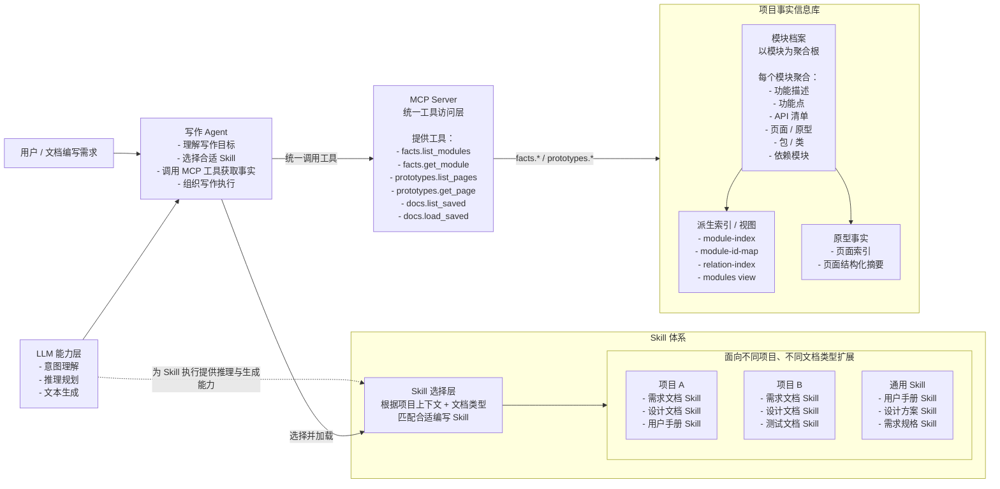

# NextAgent Doc Assistant 高层架构图

## 1. 高层架构图

## 2. 图中关系说明

- 写作 Agent 是编排与执行入口，负责接收用户需求、选择 Skill、调用 MCP 工具并组织写作过程。
- LLM 为 Agent 和 Skill 提供推理、理解和生成能力，但不直接替代知识库或工具层。
- Skill 体系体现“面向不同项目、不同文档类型扩展”的设计方式。也就是说，Skill 不是单一模板，而是可以按项目域和文档类型持续扩展。
- 项目事实信息库以“模块档案”为核心维护单元，每个模块档案就是一个知识聚合根。
- MCP Server 不直接保存知识，而是把知识库中的模块聚合事实、原型事实、历史文档等能力，统一暴露成 Agent 可调用的工具。

## 3. 这个高层图想表达的核心观点

### 3.1 项目事实信息库不是零散资料堆

它的核心组织方式是“模块为聚合根”。也就是：

- 一个模块档案聚合该模块的业务说明
- 同时聚合功能点、接口、页面、实现类和依赖关系
- Agent 优先读取“模块级完整事实包”，而不是到多个零散来源里拼装上下文

### 3.2 MCP Server 是知识访问层，不是写作层

MCP Server 的作用是把事实信息库中的知识能力，转换为统一工具接口供 Agent 使用。  
它不负责写作决策，也不负责 Skill 选择。

### 3.3 Skill 是面向项目和文档类型的专业写作能力封装

Skill 可以理解成“写作方法 + 结构规则 + 参考资料”的组合。  
在更高层抽象下，它应支持：

- 针对不同项目沉淀不同写作规范
- 针对不同文档类型沉淀不同输出结构
- 让写作 Agent 在运行时按任务选择最合适的 Skill

## 4. 适合汇报时的一句话说明

这个架构的核心是：以“模块聚合的项目事实信息库”作为知识底座，通过 MCP Server 把知识能力工具化，再由具备 Skill 选择能力的写作 Agent 联合 LLM 完成面向不同项目、不同文档类型的文档生成。
